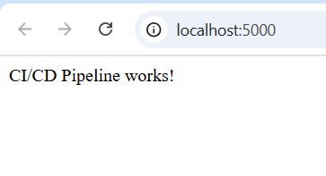

# ci-cd-flask-demo
demo CI/CD pipeline project

# 🛠️ Flask CI/CD Pipeline Demo

# 🛠️ Flask CI/CD Pipeline Demo


A beginner-friendly CI/CD pipeline project that automates building, testing, and deploying a simple Python Flask web application using **GitHub Actions** and **Docker**.

---

## 🚀 Features

-  Python Flask web app
-  Dockerized for easy deployment
-  GitHub Actions for CI/CD
-  Automated unit tests with Pytest
-  Clean and modular file structure

---

## 📂 Project Structure
ci-cd-flask-demo/
├── app.py
├── test_app.py
├── requirements.txt
├── Dockerfile
├── .github/
│ └── workflows/
│ └── ci-cd.yml
└── README.md


---

## 🧪 Run Locally

```bash
# Build the Docker image
docker build -t flask-ci-app .

# Run the container
docker run -p 5000:5000 flask-ci-app

# Open your browser at http://localhost:5000
```
## 🧪 Run Tests Locally

```bash
pip install -r requirements.txt
pip install pytest
pytest
```

## ⚙️ GitHub Actions CI/CD


> Automatically runs on every push to `main`: installs dependencies, runs tests, and builds Docker image.


Automatically runs on every push to main:
Installs dependencies, runs tests, and builds the Docker image.

Demo Screenshot



📄 License
MIT License © 2025 Samartha 

---